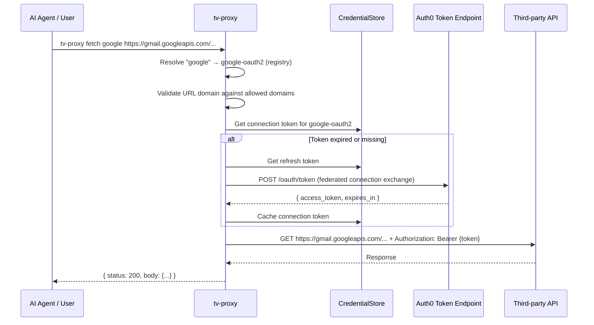

# feat: Build token-vault-proxy (tv-proxy) Rust CLI

## Overview

Build a new Rust CLI (`tv-proxy`) that acts as an authenticated HTTP proxy for third-party services via Auth0 Token Vault. Port the core auth, connection, and fetch functionality from the existing `auth0-tv` Node.js CLI into a single static binary. No service-specific commands — agents use `fetch` for everything.

## Problem Frame

AI agents need fast, reliable, dependency-free access to third-party APIs (Gmail, Slack, GitHub, etc.) on behalf of authenticated users. The existing Node.js CLI works but has ~300ms startup, requires a runtime, and bundles service-specific commands unnecessary for proxy use. A focused Rust binary eliminates these friction points. (see origin: docs/brainstorms/2026-03-30-token-vault-proxy-rust-cli-requirements.md)

## Requirements Trace

- R1-R4: Provider registry with hierarchy, aliases, case-insensitive lookup
- R5: `fetch` — authenticated HTTP passthrough with domain validation
- R6: `connect` — browser-based Connected Accounts flow with scope merging
- R7: `connections` — list connected providers (remote + local fallback)
- R8: `disconnect` — remove connection (local + optional remote)
- R9: `login` — PKCE browser login
- R10: `logout` — clear credentials, optional browser logout
- R11: `status` — show user info, token status, connections
- R12: `init` — guided setup (auth0 CLI install, configure-token-vault, login)
- R13-R16: Dual-mode output, exit codes, JSON error shapes, destructive action confirmation
- R17-R20: PKCE, token exchange, refresh, Connected Accounts flow
- R21-R22: File + keyring credential backends
- R23-R25: Config resolution, config dir, debug logging

## Scope Boundaries

- No service-specific commands (no `gmail search`, `slack channels`, etc.)
- No auto-update mechanism in v1
- No shell completion in v1
- No Windows ARM64 in v1
- Project lives in `rust-port/` directory within this repo

## Context & Research

### Relevant Code and Patterns

The existing `auth0-tv` CLI is the reference implementation. Key contracts (adapted where noted in Key Technical Decisions):

**Auth HTTP contracts:**
- OIDC discovery: `GET https://{domain}/.well-known/openid-configuration`
- PKCE authorize: `GET {authorization_endpoint}?redirect_uri=http://127.0.0.1:{port}/callback&scope=openid+profile+email+offline_access&code_challenge={challenge}&code_challenge_method=S256&state={state}`
- Token exchange (authorization code): `POST {token_endpoint}` with `grant_type=authorization_code`
- Token refresh: `POST {token_endpoint}` with `grant_type=refresh_token`
- Federated connection token exchange: `POST {token_endpoint}` with `grant_type=urn:auth0:params:oauth:grant-type:token-exchange:federated-connection-access-token`
- My Account API: `POST /me/v1/connected-accounts/connect`, `POST /me/v1/connected-accounts/complete`, `GET /me/v1/connected-accounts/accounts`, `DELETE /me/v1/connected-accounts/accounts/{id}`

**Data shapes (JSON, camelCase for storage compatibility):**
- `Auth0Tokens { accessToken, refreshToken?, idToken?, expiresAt }`
- `ConnectionToken { accessToken, expiresAt, scopes[] }`
- `StoredConfig { domain, clientId, clientSecret, audience? }`
- `ServiceSettings { allowedDomains[] }`
- `CredentialData { config?, auth0?, connections: Map, serviceSettings?: Map }`

**Keyring naming (auth0-tv reference):** service=`"auth0-tv"`, accounts=`AUTH0_CONFIG`, `AUTH0_TOKENS`, `CONNECTION:{name}`, `SETTINGS:{name}` — tv-proxy uses same account naming pattern but under service name `"tv-proxy"` (see Key Technical Decisions)

**Exit codes:** 1=general, 2=invalid input, 3=auth required, 4=authz required, 5=service error, 6=network error

### External References

- `clap` v4 derive macros for CLI — the standard Rust CLI framework
- `reqwest` v0.12 with `rustls-tls` for HTTP (avoids OpenSSL dependency for static linking)
- `keyring` v3 crate for cross-platform credential storage
- `tiny_http` for the local OAuth callback server — synchronous, zero-dependency, handles one request then shuts down
- `sha2` + `base64` for PKCE S256 challenge generation (no need for the full `openidconnect` crate)
- `jsonwebtoken` for JWT decoding without verification
- `dialoguer` for interactive prompts in `init`
- `colored` for terminal colors
- `serde` + `serde_json` for serialization
- `tokio` v1 as async runtime
- `tracing` + `tracing-subscriber` for debug logging
- `anyhow` for application error handling, `thiserror` for library-level error types

## Key Technical Decisions

- **Manual OAuth2/OIDC instead of openidconnect crate**: The Auth0 token exchange uses custom grant types (`urn:auth0:params:oauth:grant-type:token-exchange:federated-connection-access-token`) that the `openidconnect` crate doesn't support natively. Better to do manual HTTP with `reqwest` — the OIDC discovery is just a JSON fetch, PKCE is sha2+base64, and all token operations are form-encoded POSTs. This gives full control over the Auth0-specific protocol.
- **`tiny_http` for callback server**: The OAuth callback only needs to handle one request then shut down. `tiny_http` is synchronous, zero-dependency, and perfect for this. No need for `axum` or `actix-web` complexity.
- **`rustls-tls` over native-tls**: Avoids requiring OpenSSL for static binary distribution. `reqwest` supports this feature flag.
- **`thiserror` for domain errors, `anyhow` for command-level**: Domain types (auth, store, registry) use `thiserror` enums with exit codes. Commands use `anyhow` for context propagation. The main function maps errors to exit codes.
- **Keyring service name `"tv-proxy"`**: Use a new service name, not `"auth0-tv"`, to avoid conflicts. The two CLIs can coexist but don't share credentials.
- **camelCase JSON for storage**: Use `#[serde(rename_all = "camelCase")]` on storage structs to match the existing auth0-tv file format shape, enabling potential future cross-compatibility.

## Open Questions

### Resolved During Planning

- **OIDC crate vs manual HTTP**: Manual HTTP. The custom grant types make the `openidconnect` crate more hindrance than help. All token endpoint calls are simple form-encoded POSTs.
- **Callback server framework**: `tiny_http`. Single synchronous request handler, shuts down immediately. No async overhead.
- **TLS backend**: `rustls-tls` for static binary portability.
- **Token vault configuration command**: `npx auth0-ai-cli configure-auth0-token-vault` (per updated requirements)

### Deferred to Implementation

- Whether `fetch` should stream large responses or buffer entirely — try buffering first, stream if memory becomes an issue
- Exact `keyring` crate error types on Linux when secret-service is unavailable — handle at implementation time with graceful fallback to file backend
- Binary size optimization (LTO, strip) — tune in release profile after initial build works

## High-Level Technical Design

> *This illustrates the intended approach and is directional guidance for review, not implementation specification. The implementing agent should treat it as context, not code to reproduce.*

```
rust-port/
├── Cargo.toml
├── src/
│   ├── main.rs              # Entry point, clap parse, error-to-exit-code mapping
│   ├── cli.rs                # Clap derive structs (Cli, Commands enum, per-command args)
│   ├── commands/
│   │   ├── mod.rs
│   │   ├── login.rs          # PKCE login flow
│   │   ├── logout.rs         # Clear credentials + browser logout
│   │   ├── status.rs         # Show user info + connections
│   │   ├── connect.rs        # Connected Accounts browser flow
│   │   ├── connections.rs    # List connections
│   │   ├── disconnect.rs     # Remove connection
│   │   ├── fetch.rs          # Authenticated HTTP passthrough
│   │   └── init.rs           # Guided setup wizard
│   ├── auth/
│   │   ├── mod.rs
│   │   ├── oidc.rs           # OIDC discovery + config caching
│   │   ├── pkce.rs           # PKCE code verifier/challenge generation
│   │   ├── token_exchange.rs # All token endpoint operations (auth code, refresh, federated)
│   │   ├── connected_accounts.rs  # My Account API (initiate, complete, list, delete)
│   │   └── callback_server.rs     # Local HTTP server for OAuth callbacks
│   ├── store/
│   │   ├── mod.rs
│   │   ├── types.rs          # Auth0Tokens, ConnectionToken, StoredConfig, etc.
│   │   ├── backend.rs        # CredentialBackend trait
│   │   ├── file_backend.rs   # JSON file storage
│   │   ├── keyring_backend.rs # OS keyring storage
│   │   └── credential_store.rs # Facade with expiry logic, auto-refresh
│   ├── registry.rs           # Provider > Service hierarchy, aliases, lookups
│   ├── output.rs             # Dual-mode output (human/JSON), error formatting
│   ├── config.rs             # Config resolution (env > store), required field validation
│   ├── exit_codes.rs         # Exit code constants
│   └── error.rs              # AppError enum with exit code mapping
└── tests/
    ├── common/
    │   └── mod.rs            # Test helpers, mock server setup
    ├── auth/
    │   ├── pkce_test.rs
    │   ├── token_exchange_test.rs
    │   └── callback_server_test.rs
    ├── store/
    │   ├── file_backend_test.rs
    │   └── credential_store_test.rs
    ├── registry_test.rs
    ├── fetch_test.rs
    ├── connect_test.rs
    └── output_test.rs
```



## Implementation Units

### Phase 1: Foundation (project skeleton, types, storage, config)

- [ ] **Unit 1: Project scaffold and CLI skeleton**

**Goal:** Create the Rust project with Cargo.toml, clap CLI definition with all commands (stubbed), and the build pipeline.

**Requirements:** R13 (global --json flag), all commands as subcommands

**Dependencies:** None

**Files:**
- Create: `rust-port/Cargo.toml`
- Create: `rust-port/src/main.rs`
- Create: `rust-port/src/cli.rs`
- Create: `rust-port/src/exit_codes.rs`
- Create: `rust-port/src/error.rs`
- Create: `rust-port/src/output.rs`
- Create: `rust-port/src/commands/mod.rs`
- Create: `rust-port/.gitignore`

**Approach:**
- Cargo.toml with all dependencies declared upfront (clap, reqwest, serde, serde_json, tokio, keyring, tiny_http, sha2, base64, jsonwebtoken, dialoguer, colored, tracing, tracing-subscriber, anyhow, thiserror, open, dirs)
- Use `reqwest` with features `json, rustls-tls` (no default features to avoid native-tls)
- `tokio` with features `full`
- Clap derive structs: `Cli` with global `--json` flag, `Commands` enum with all 8 subcommands and their argument structs
- `AppError` enum using `thiserror` with variants mapping to exit codes
- `output()` and `output_error()` functions that check global JSON mode
- Each command file exports an `async fn execute(args, global_opts) -> Result<()>`
- `main.rs`: parse CLI, dispatch to command, catch errors and map to exit codes

**Patterns to follow:**
- `src/utils/exit-codes.ts` for exit code values
- `src/utils/output.ts` for dual-mode output contract

**Test scenarios:**
- CLI parses all subcommands without error
- `--json` flag is accessible on all commands
- `--help` displays all commands
- Unknown command exits with code 2

**Verification:**
- `cargo build` succeeds
- `cargo run -- --help` shows all commands
- `cargo run -- fetch --help` shows fetch options

---

- [ ] **Unit 2: Provider registry**

**Goal:** Implement the provider > service hierarchy with alias resolution and lookup functions.

**Requirements:** R1, R2, R3, R4

**Dependencies:** Unit 1

**Files:**
- Create: `rust-port/src/registry.rs`
- Test: `rust-port/tests/registry_test.rs`

**Approach:**
- Static data: `ProviderEntry { connection: &str, aliases: &[&str], services: HashMap<&str, ServiceEntry> }` where `ServiceEntry { scopes: Vec<&str>, allowed_domains: Vec<&str> }`
- Lookup functions: `resolve_provider(input) -> Option<(connection_name, &ProviderEntry)>` — checks aliases then connection names, case-insensitive. `resolve_service(input) -> Option<(connection_name, service_name, &ServiceEntry)>` — checks service names. `resolve_any(input) -> Resolution` enum — tries provider first, then service, returns `ProviderMatch`, `ServiceMatch`, or `Unknown(raw_name)`.
- `get_all_provider_scopes(provider) -> Vec<String>` — union of all service scopes
- `get_allowed_domains(connection, service?) -> Vec<String>` — from registry entry
- Unknown providers: `resolve_any` returns `Unknown` variant, callers pass through to Auth0

**Patterns to follow:**
- `src/utils/service-registry.ts` for the exact scopes and allowed domains per service

**Test scenarios:**
- `resolve_any("google")` returns ProviderMatch for `google-oauth2`
- `resolve_any("gmail")` returns ServiceMatch for `google-oauth2`/`gmail`
- `resolve_any("google-oauth2")` returns ProviderMatch (exact connection name)
- `resolve_any("GOOGLE")` works (case-insensitive)
- `resolve_any("custom-provider")` returns Unknown
- `get_all_provider_scopes("google-oauth2")` returns union of gmail + calendar scopes
- Known provider scopes match auth0-tv's `service-registry.ts` exactly

**Verification:**
- All registry tests pass
- Provider hierarchy matches auth0-tv service registry

---

- [ ] **Unit 3: Credential storage types and file backend**

**Goal:** Define storage types and implement the file backend.

**Requirements:** R21, R22, R24

**Dependencies:** Unit 1

**Files:**
- Create: `rust-port/src/store/mod.rs`
- Create: `rust-port/src/store/types.rs`
- Create: `rust-port/src/store/backend.rs`
- Create: `rust-port/src/store/file_backend.rs`
- Test: `rust-port/tests/store/file_backend_test.rs`

**Approach:**
- Types use `#[serde(rename_all = "camelCase")]` for JSON compat
- `CredentialBackend` trait with sync methods (keyring crate is sync, file I/O is sync — no need for async on the storage layer)
- `FileBackend`: reads/writes `~/.tv-proxy/credentials.json` atomically (write to temp, rename). Dir mode 0o700, file mode 0o600 on Unix. Config dir from `TV_PROXY_CONFIG_DIR` env var.
- `clear()` preserves config and serviceSettings, wipes auth0 and connections

**Patterns to follow:**
- `src/store/types.ts` for exact field names and shapes
- `src/store/credential-store.ts` FileBackend for file permissions and atomic write pattern

**Test scenarios:**
- Save and retrieve config round-trips correctly
- Save and retrieve tokens round-trips correctly
- Save and retrieve connection tokens for multiple providers
- `clear()` wipes tokens but preserves config and service settings
- File is created with restricted permissions (0o600)
- Missing file returns None for all getters
- Corrupt JSON file returns error gracefully

**Verification:**
- File backend tests pass with temp directories
- JSON output matches camelCase field naming

---

- [ ] **Unit 4: Keyring backend**

**Goal:** Implement OS keyring credential storage.

**Requirements:** R21

**Dependencies:** Unit 3 (backend trait)

**Files:**
- Create: `rust-port/src/store/keyring_backend.rs`
- Test: `rust-port/tests/store/keyring_backend_test.rs`

**Approach:**
- Uses `keyring` crate v3. Service name: `"tv-proxy"`.
- Account naming: `AUTH0_CONFIG`, `AUTH0_TOKENS`, `CONNECTION:{name}`, `SETTINGS:{name}` — same pattern as auth0-tv but under different service name.
- All values stored as JSON strings via serde_json.
- `list_connections()`: iterate credentials looking for `CONNECTION:` prefix.
- `clear()`: deletes all entries except `AUTH0_CONFIG` and `SETTINGS:*`.
- Graceful fallback: if keyring operations fail (e.g., no secret-service on Linux), surface a clear error suggesting `TV_PROXY_STORAGE=file`.

**Patterns to follow:**
- `src/store/keyring-backend.ts` for account naming scheme

**Test scenarios:**
- Save and retrieve config via keyring
- Save and retrieve tokens via keyring
- List connections returns only `CONNECTION:*` entries
- `clear()` preserves config and settings
- Keyring unavailable error is descriptive

**Verification:**
- Tests pass (may need to be integration tests or conditionally skipped on CI without keyring)

---

- [ ] **Unit 5: CredentialStore facade and config resolution**

**Goal:** Implement the credential store facade with expiry logic and auto-refresh, plus config resolution.

**Requirements:** R19, R22, R23, R24, R25

**Dependencies:** Unit 3, Unit 4

**Files:**
- Create: `rust-port/src/store/credential_store.rs`
- Create: `rust-port/src/config.rs`
- Test: `rust-port/tests/store/credential_store_test.rs`

**Approach:**
- `CredentialStore` wraps a `Box<dyn CredentialBackend>`. Constructor selects backend via `TV_PROXY_STORAGE` env var (default: `keyring`, fallback: `file`).
- Expiry buffer: 2 minutes (120_000 ms). `is_token_expired(expires_at) -> bool`.
- `get_connection_token()`: returns cached token if not expired, otherwise returns None (caller handles exchange).
- `get_auth0_token()`: if expired and refresh token exists, auto-refreshes (requires passing a token refresh function to avoid circular dependency).
- Config resolution: `merge_config(store) -> (ResolvedConfig, Vec<MissingField>)`. Env vars > stored values per field: `AUTH0_DOMAIN`, `AUTH0_CLIENT_ID`, `AUTH0_CLIENT_SECRET`, `AUTH0_AUDIENCE`.
- Debug logging setup: `tracing_subscriber` with `EnvFilter` from `RUST_LOG` or `TV_PROXY_DEBUG`, output to stderr.

**Patterns to follow:**
- `src/store/credential-store.ts` for expiry buffer and auto-refresh logic
- `src/utils/config.ts` for field-level precedence

**Test scenarios:**
- Token within expiry buffer is treated as expired
- Token beyond expiry buffer is valid
- Config merges env vars over stored values correctly
- Missing required fields are reported
- Backend selection defaults to keyring, respects env var

**Verification:**
- Facade tests pass with mock/file backend
- Config resolution matches auth0-tv behavior

---

### Phase 2: Auth flows (PKCE, token exchange, callback server)

- [ ] **Unit 6: OIDC discovery, PKCE, and callback server**

**Goal:** Implement OIDC discovery fetching, PKCE code verifier/challenge generation, and the local HTTP callback server.

**Requirements:** R17

**Dependencies:** Unit 1 (error types, output)

**Files:**
- Create: `rust-port/src/auth/mod.rs`
- Create: `rust-port/src/auth/oidc.rs`
- Create: `rust-port/src/auth/pkce.rs`
- Create: `rust-port/src/auth/callback_server.rs`
- Test: `rust-port/tests/auth/pkce_test.rs`
- Test: `rust-port/tests/auth/callback_server_test.rs`

**Approach:**
- OIDC discovery: `GET https://{domain}/.well-known/openid-configuration`, parse JSON for `authorization_endpoint`, `token_endpoint`, `issuer`. Cache per domain (process lifetime via `OnceCell` or similar).
- PKCE: generate 32-byte random verifier (base64url), compute SHA-256 challenge (base64url). Use `sha2` + `base64` crates.
- Callback server: `tiny_http::Server` binding to `127.0.0.1` on ports 18484-18489 (try sequentially). Accepts one request on `/callback`, extracts query params (`code`, `state`, `error`, `error_description`), serves HTML response with auto-close script, shuts down. 2-minute timeout. Runs in a dedicated thread (not async — it's a blocking single-request server).
- HTML response: minimal page with success/error message and `<script>window.close()</script>`

**Patterns to follow:**
- `src/auth/pkce-flow.ts` for PKCE generation
- `src/auth/oidc-config.ts` for discovery URL and caching
- `src/auth/browser.ts` for port binding, HTML pages

**Test scenarios:**
- PKCE verifier is valid base64url, challenge matches SHA-256
- OIDC discovery parses standard Auth0 response
- Callback server binds to first available port
- Callback server extracts code and state from query string
- Callback server handles error response from Auth0
- Callback server times out after 2 minutes

**Verification:**
- PKCE and callback server tests pass
- Callback HTML includes auto-close script

---

- [ ] **Unit 7: Token endpoint operations (authorization code, refresh, federated exchange)**

**Goal:** Implement all token endpoint POST operations.

**Requirements:** R17, R18, R19

**Dependencies:** Unit 6 (OIDC discovery)

**Files:**
- Create: `rust-port/src/auth/token_exchange.rs`
- Test: `rust-port/tests/auth/token_exchange_test.rs`
- Test helpers: `rust-port/tests/common/mod.rs` (mock token server)

**Approach:**
- All three operations POST form-encoded data to the token endpoint from OIDC discovery.
- `exchange_authorization_code(config, code, redirect_uri, code_verifier) -> Auth0Tokens`: `grant_type=authorization_code` with `code`, `redirect_uri`, `code_verifier`, `client_id`, `client_secret`.
- `refresh_tokens(config, refresh_token) -> Auth0Tokens`: `grant_type=refresh_token`. Preserves old refresh_token if new one not returned (rotation support).
- `exchange_connection_token(config, refresh_token, connection, scopes?) -> ConnectionToken`: `grant_type=urn:auth0:params:oauth:grant-type:token-exchange:federated-connection-access-token`, `subject_token_type=urn:ietf:params:oauth:token-type:refresh_token`, `subject_token={refresh_token}`, `connection={name}`, `requested_token_type=http://auth0.com/oauth/token-type/federated-connection-access-token`.
- Error mapping from JSON `error` field: `unauthorized_client`/`access_denied` -> exit 4, `invalid_grant`/`expired_token` -> exit 3, `federated_connection_refresh_token_flow_failed` -> exit 4, other -> exit 5.
- Scope validation: if required scopes specified, check granted scopes contain all of them.
- Use `reqwest::Client` with 30-second timeout.

**Patterns to follow:**
- `src/auth/token-exchange.ts` for exact grant types, URNs, and error mapping
- `src/auth/token-refresh.ts` for refresh token rotation logic

**Test scenarios:**
- Authorization code exchange returns valid tokens
- Refresh token exchange preserves old refresh_token when new one absent
- Federated exchange returns connection token with scopes
- Error responses map to correct exit codes (unauthorized_client->4, invalid_grant->3, etc.)
- Scope validation catches missing required scopes
- Network timeout produces exit code 6

**Verification:**
- All token exchange tests pass with mock HTTP server
- Error code mapping matches auth0-tv exactly

---

- [ ] **Unit 8: Connected Accounts flow (My Account API)**

**Goal:** Implement the 5-step Connected Accounts browser flow for connecting providers.

**Requirements:** R20

**Dependencies:** Unit 6 (callback server), Unit 7 (token exchange for My Account token)

**Files:**
- Create: `rust-port/src/auth/connected_accounts.rs`
- Test: `rust-port/tests/auth/connected_accounts_test.rs`

**Approach:**
- Step 1: Get My Account API token via refresh grant with `audience=https://{domain}/me/` and `scope=create:me:connected_accounts read:me:connected_accounts delete:me:connected_accounts`.
- Step 2: POST to `/me/v1/connected-accounts/connect` with connection, redirect_uri, state, scopes. Parse `ConnectInitResponse { auth_session, connect_uri, connect_params: { ticket }, expires_in }`.
- Step 3: Open browser to `{connect_uri}?ticket={ticket}`.
- Step 4: Wait for callback with `connect_code` (falling back to `code` param) and `state` validation.
- Step 5: POST to `/me/v1/connected-accounts/complete` with auth_session, connect_code, redirect_uri. Parse `ConnectCompleteResponse { id, connection, scopes }`.
- Also: `list_connected_accounts()` and `delete_connected_account()` for connections/disconnect commands.
- 30-second HTTP timeout on all My Account API calls.

**Patterns to follow:**
- `src/auth/connected-accounts.ts` for exact HTTP contracts, request/response shapes

**Test scenarios:**
- Full 5-step flow completes successfully (mocked endpoints)
- State mismatch on callback returns error
- Error on callback (error param) returns descriptive message
- List accounts returns parsed account list
- Delete account handles 2xx success and non-2xx error
- My Account token refresh failure returns exit code 3

**Verification:**
- Connected Accounts tests pass
- HTTP request bodies match auth0-tv format exactly

---

### Phase 3: Commands (login, logout, status, connect, connections, disconnect, fetch, init)

- [ ] **Unit 9: login and logout commands**

**Goal:** Wire up the PKCE login flow and logout as complete CLI commands.

**Requirements:** R9, R10

**Dependencies:** Unit 5 (credential store), Unit 6 (PKCE, callback), Unit 7 (token exchange)

**Files:**
- Create: `rust-port/src/commands/login.rs`
- Create: `rust-port/src/commands/logout.rs`

**Approach:**
- `login`: resolve config (prompt if in init context, otherwise require env/store), run PKCE flow, save tokens.  Supports `--browser <path>` and `--port <number>` flags, plus `--connection`, `--connection-scope`, `--audience`, `--scope` for advanced usage.
- `logout`: load stored config, clear credentials via `store.clear()`. If not `--local`, open browser to `https://{domain}/v2/logout?client_id={id}&returnTo=http://127.0.0.1:{port}`. Start callback server to serve "logged out" HTML, auto-close after 10 seconds.
- Output shapes match auth0-tv: `{ status: "logged_in", user: {...} }` / `{ status: "logged_out" }`.

**Patterns to follow:**
- `src/commands/login.ts` for flow orchestration
- `src/commands/logout.ts` for logout sequence

**Test scenarios:**
- Login saves tokens to credential store
- Login with missing config exits with code 2
- Logout clears tokens from store
- Logout with `--local` skips browser
- Logout when not logged in is a no-op (success)

**Verification:**
- Login and logout commands work end-to-end (manual test with real Auth0 tenant)

---

- [ ] **Unit 10: status command**

**Goal:** Show current user info, token status, and connected providers.

**Requirements:** R11

**Dependencies:** Unit 5 (credential store), Unit 2 (registry)

**Files:**
- Create: `rust-port/src/commands/status.rs`

**Approach:**
- Decode ID token JWT (without verification) to get user info (sub, name, email, picture).
- Show token status: valid, expired, or not logged in.
- List connections from store, show token status per connection.
- Show storage backend type.
- JSON output shape: `{ status: "logged_in"|"not_logged_in", user?: { sub, name, email }, tokens: { status, expiresAt }, connections: [...], storage: "keyring"|"file" }`.

**Patterns to follow:**
- `src/commands/status.ts` for output shape and JWT decoding

**Test scenarios:**
- Status shows user info when logged in
- Status shows "not_logged_in" when no tokens
- Status with expired token shows "expired"
- Connections include token status per provider

**Verification:**
- Status command output matches auth0-tv JSON shape

---

- [ ] **Unit 11: connect and disconnect commands**

**Goal:** Implement provider connection and disconnection.

**Requirements:** R6, R8

**Dependencies:** Unit 2 (registry), Unit 5 (credential store), Unit 7 (token exchange), Unit 8 (Connected Accounts)

**Files:**
- Create: `rust-port/src/commands/connect.rs`
- Create: `rust-port/src/commands/disconnect.rs`
- Test: `rust-port/tests/connect_test.rs`

**Approach:**
- `connect <provider>`: resolve provider via registry. Determine scopes: if `--service`, use that service's scopes; else union of all provider service scopes. Merge with `--scopes` if provided. Deduplicate. For unknown providers, use `--scopes` as-is. Fetch remote accounts to merge existing scopes (non-fatal failure). Run Connected Accounts flow. Validate with token exchange (warning on failure, not hard error). Save `--allowed-domains` to service settings.
- `disconnect <provider>`: resolve provider. Remove local connection token. If `--remote`, get My Account API token, find matching account, delete it (warning on failure).
- Output shapes match auth0-tv: `{ status: "connected", connection, scopes, ... }` / `{ status: "disconnected", connection, remote }`.

**Patterns to follow:**
- `src/commands/connect.ts` for scope merging and flow orchestration
- `src/commands/disconnect.ts` for two-phase disconnect

**Test scenarios:**
- Connect resolves provider alias correctly
- Connect merges scopes from multiple services under same provider
- Connect with `--service` uses only that service's scopes
- Connect with `--scopes` merges user scopes with defaults
- Connect for unknown provider passes through to Auth0
- Connect saves allowed-domains to settings
- Disconnect removes local token
- Disconnect with `--remote` calls delete API
- Disconnect remote failure is warning, not error

**Verification:**
- Connect and disconnect work with mock Auth0 endpoints

---

- [ ] **Unit 12: connections command**

**Goal:** List connected providers with remote and local fallback.

**Requirements:** R7

**Dependencies:** Unit 2 (registry), Unit 5 (credential store), Unit 8 (Connected Accounts list)

**Files:**
- Create: `rust-port/src/commands/connections.rs`

**Approach:**
- Try remote: get My Account API token, list connected accounts. Cross-reference with local cache for token status.
- Fallback to local: if not logged in or API fails, list only locally cached connections.
- Enrich with registry data: map connection name to provider alias and services.
- Token status: check expiry with 2-minute buffer.
- JSON shape: `{ connections: [{ connection, provider, services, scopes, tokenStatus, remote }] }`.

**Patterns to follow:**
- `src/commands/connections.ts` for remote/local modes and output shape

**Test scenarios:**
- Remote mode returns full connection list
- Local fallback works when not logged in
- Token status reflects expiry buffer
- Empty state returns `{ connections: [] }`

**Verification:**
- Connections output matches auth0-tv JSON shape

---

- [ ] **Unit 13: fetch command**

**Goal:** Implement the authenticated HTTP passthrough — the primary interface for agents.

**Requirements:** R5, R16

**Dependencies:** Unit 2 (registry), Unit 5 (credential store), Unit 7 (token exchange)

**Files:**
- Create: `rust-port/src/commands/fetch.rs`
- Test: `rust-port/tests/fetch_test.rs`

**Approach:**
- Resolve first arg via `resolve_any()`: ProviderMatch, ServiceMatch, or Unknown.
- For Unknown: require stored allowed-domains, error if none configured.
- URL validation: must parse, must be HTTPS.
- Domain validation: extract host from URL, check against allowed domains (registry defaults union stored per-service settings). Wildcard matching: `*.example.com` matches any subdomain (including nested) but not `example.com` itself.
- Token exchange: get connection token from store (cached) or exchange via federated grant.
- HTTP request: inject `Authorization: Bearer {token}` header. User headers (`-H`) can override. Body from `-d` or `--data-file`. Method from `-X` (default GET).
- Response: auto-detect JSON vs text via Content-Type. Non-2xx exits with code 5 but still outputs body.
- Network errors (connection refused, timeout): exit code 6.
- Destructive action check: if method is POST/PUT/PATCH/DELETE and not interactive (no TTY), require `--confirm` or `--yes`.

**Patterns to follow:**
- `src/commands/fetch.ts` for URL/domain validation, HTTP passthrough, and response handling
- `isDomainAllowed` logic for wildcard matching

**Test scenarios:**
- `fetch google https://gmail.googleapis.com/...` resolves and makes request
- `fetch gmail https://gmail.googleapis.com/...` resolves via service name
- `fetch unknown-provider https://example.com/...` fails if no allowed-domains configured
- Non-HTTPS URL rejected with exit 2
- Domain not in allowed list rejected with exit 2
- Wildcard domain `*.googleapis.com` matches `gmail.googleapis.com` and `www.googleapis.com`
- Non-2xx response outputs body and exits 5
- Network error exits 6
- Headers parsed correctly (`Key: Value` format)
- POST without `--confirm` in non-TTY mode exits 2

**Verification:**
- Fetch tests pass with mock HTTP server
- Domain validation matches auth0-tv behavior exactly

---

- [ ] **Unit 14: init command**

**Goal:** Interactive guided setup wizard.

**Requirements:** R12

**Dependencies:** Unit 9 (login command)

**Files:**
- Create: `rust-port/src/commands/init.rs`

**Approach:**
- Use `dialoguer` for interactive prompts (Select, Input, Confirm).
- Step 1: Check if `auth0` CLI is installed (run `auth0 --version`). If not, offer to install via brew (`brew tap auth0/auth0-cli && brew install auth0`) or suggest manual install. Skip if user declines.
- Step 2: Check if logged into auth0 CLI (`auth0 tenants list`). If not, run `auth0 login`.
- Step 3: Run `npx auth0-ai-cli configure-auth0-token-vault` for Token Vault setup.
- Step 4: Ask for AUTH0_DOMAIN, CLIENT_ID, CLIENT_SECRET (with sensible prompts). Save to credential store.
- Step 5: Run the `login` command flow.
- Step 6: Print summary: config saved, logged in, next steps (connect a provider).
- All subprocess calls use `std::process::Command` with inherited stdin/stdout for interactive subprocesses.

**Patterns to follow:**
- No direct auth0-tv equivalent — this is new functionality

**Test scenarios:**
- Init detects auth0 CLI presence
- Init handles auth0 CLI absence gracefully
- Init saves config to store
- Init runs login flow at the end
- Non-interactive mode (no TTY) exits with clear error

**Verification:**
- Init command runs through all steps interactively (manual test)

---

### Phase 4: Polish and testing

- [ ] **Unit 15: Integration tests and CI setup**

**Goal:** End-to-end integration tests and build configuration.

**Requirements:** All

**Dependencies:** All prior units

**Files:**
- Create: `rust-port/tests/integration/mod.rs`
- Create: `rust-port/tests/integration/fetch_e2e.rs`
- Create: `rust-port/tests/integration/connect_e2e.rs`
- Modify: `rust-port/Cargo.toml` (release profile optimization)

**Approach:**
- Integration tests run the compiled binary as a subprocess with mock environment.
- Mock Auth0 endpoints via `httpmock` or `wiremock` crate.
- Test complete flows: login -> connect -> fetch -> disconnect.
- Verify JSON output shapes match auth0-tv.
- Verify exit codes for all error conditions.
- Release profile: `lto = true`, `strip = true`, `opt-level = "z"` for size.
- Add `CLAUDE.md` for the rust-port project with build/test/lint commands.

**Test scenarios:**
- Full flow: login succeeds, fetch returns expected response
- Auth failure: expired token triggers correct exit code
- Connection failure: unconnected provider triggers correct exit code
- JSON mode: all commands output valid JSON
- Exit codes match auth0-tv for equivalent scenarios

**Verification:**
- All tests pass
- Binary size is reasonable (< 20MB with LTO + strip)
- `cargo clippy` passes with no warnings
- `cargo fmt --check` passes

---

## System-Wide Impact

- **Interaction graph:** The CLI interacts with Auth0 authorization server (OIDC discovery, token endpoint, My Account API), third-party APIs (via fetch), and the local OS keyring. No internal services affected.
- **Error propagation:** Auth module errors map to typed `AppError` variants with exit codes. Commands catch errors and route through `output_error()` for consistent formatting.
- **State lifecycle risks:** Credential store writes should be atomic (write-to-temp-then-rename for file backend) to prevent corruption on crash. Keyring backend is inherently atomic per entry.
- **API surface parity:** Exit codes and JSON output shapes must match auth0-tv. This is the primary compatibility contract.
- **Integration coverage:** End-to-end tests in Unit 15 cover cross-layer scenarios (registry -> token exchange -> HTTP passthrough) that unit tests can't.

## Risks & Dependencies

- **Keyring crate on Linux:** `secret-service` D-Bus may not be available on all systems. Mitigation: file backend auto-fallback with clear error message.
- **Binary size:** Rust binaries with many dependencies can be large. Mitigation: LTO, strip, and `opt-level = "z"` in release profile. Estimated 10-20 MB.
- **Auth0 API changes:** The federated connection token exchange and My Account API are Auth0-specific. If endpoints change, the CLI breaks. Mitigation: same risk exists in auth0-tv; both would need updating.
- **Cross-platform testing:** macOS Keychain, Windows Credential Manager, and Linux secret-service all behave differently. Mitigation: integration test on CI for each platform (conditional keyring tests).

## Phased Delivery

### Phase 1: Foundation (Units 1-5)
Project skeleton, provider registry, credential storage. After this phase, the build compiles and the storage layer is complete.

### Phase 2: Auth flows (Units 6-8)
PKCE, all token operations, Connected Accounts. After this phase, all Auth0 protocol interactions work.

### Phase 3: Commands (Units 9-14)
All CLI commands wired up. After this phase, the CLI is functionally complete.

### Phase 4: Polish (Unit 15)
Integration tests, CI, release profile. After this phase, the CLI is ready for distribution.

## Sources & References

- **Origin document:** [docs/brainstorms/2026-03-30-token-vault-proxy-rust-cli-requirements.md](docs/brainstorms/2026-03-30-token-vault-proxy-rust-cli-requirements.md)
- Reference implementation: `src/` directory of the existing auth0-tv Node.js CLI
- Feasibility analysis: `docs/RUST_FEASIBILITY.md`
- Key auth0-tv files: `src/auth/pkce-flow.ts`, `src/auth/token-exchange.ts`, `src/auth/connected-accounts.ts`, `src/store/credential-store.ts`, `src/utils/service-registry.ts`, `src/commands/fetch.ts`
