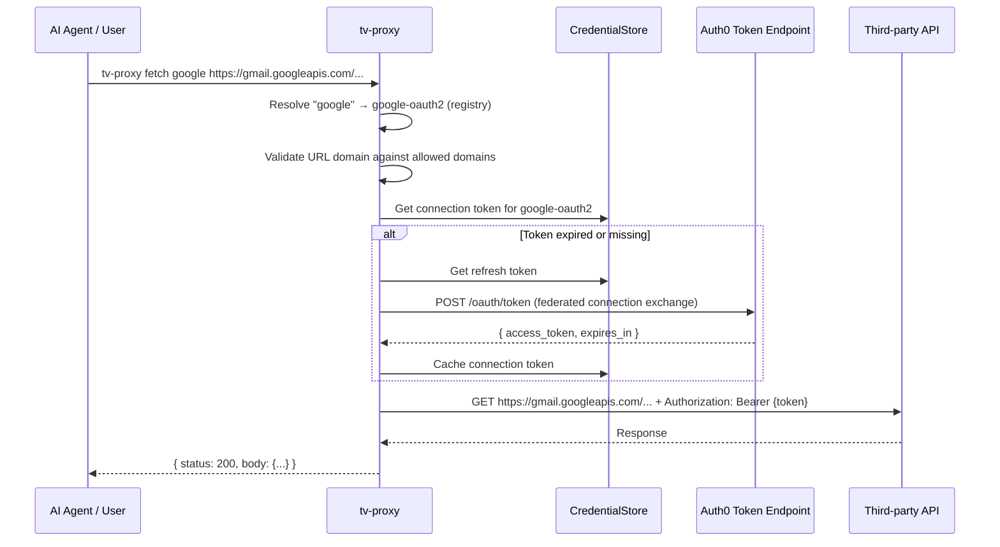

# feat: Build token-vault-proxy Rust CLI (tv-proxy)

## Overview

Build a new Rust CLI called `token-vault-proxy` (executable: `tv-proxy`) that provides authenticated API proxy access to third-party services via Auth0 Token Vault. This is a focused, simplified counterpart to the Node.js `auth0-tv` CLI — it has no service-specific commands (no `gmail search`, `slack post`, etc.), instead offering a generic `fetch` proxy. Designed as a dual-mode tool for both humans and AI agents (via `--json` output).

## Problem Frame

AI agents and human developers need fast, reliable, dependency-free access to third-party APIs (Gmail, Slack, GitHub, Google Calendar, etc.) on behalf of authenticated users via Auth0 Token Vault. The existing Node.js CLI works but has ~300ms startup, requires a runtime, and bundles service-specific commands unnecessary for proxy use.

A Rust binary offers:
- Single-binary distribution (no runtime dependency)
- ~6x faster startup (~50ms vs ~300ms) — meaningful for AI agents that invoke it frequently
- ~10x smaller memory footprint
- Simpler installation and deployment

The Rust CLI is **not** a 1:1 port — it strips out service-specific commands and focuses on the core proxy/connection/auth capabilities. (see origin: docs/brainstorms/2026-03-30-token-vault-proxy-rust-cli-requirements.md)

## Requirements Trace

- R1. `fetch <service|provider> <url>` — authenticated HTTP proxy supporting method, headers, body, domain validation
- R2. `connect <provider>` — connect OAuth providers via Connected Accounts API, with friendly aliases and scope merging
- R3. `connections` — list connected providers (remote first, local fallback)
- R4. `disconnect <provider>` — local + optional remote disconnection
- R5. `login` — browser-based PKCE login with local callback server
- R6. `logout` — clear stored credentials, optional browser logout
- R7. `status` — show user info, token status, connected providers
- R8. `init` — interactive setup wizard (install auth0 CLI, configure token vault, login)
- R9. Dual output mode — human-readable (default) and JSON (`--json` or `TV_PROXY_OUTPUT=json`)
- R10. Credential storage — keyring backend (default) + file backend fallback
- R11. Exit codes — structured codes matching auth0-tv conventions (0-6)
- R12. Both provider names (`google-oauth2`, `github`) and friendly aliases (`google`, `slack`) supported across all commands
- R13. `fetch` additionally accepts service names (`gmail`, `calendar`) and resolves them to providers
- R14. Full behavioral compatibility with auth0-tv: same exit codes, same JSON output shapes, same env vars
- R15. JSON errors to stdout (for agent parsing): `{ "error": { "code": "...", "message": "...", "details": ... } }`. Human errors to stderr.
- R16. `--confirm` / `--yes` flag for destructive actions in non-interactive mode

## Scope Boundaries

- **In scope:** All 8 commands listed above, provider registry, credential storage, PKCE auth, token exchange, Connected Accounts API
- **Not in scope:** Service-specific typed commands (gmail search, slack post, etc.), shell completions (future), auto-update mechanism (future)
- **Not in scope:** Publishing to crates.io (use `cargo install --path` or binary releases initially)
- **Not in scope:** Windows ARM64 in v1

## Context & Research

### Relevant Code and Patterns

The existing Node.js CLI serves as the reference implementation. Key files:

- `src/auth/pkce-flow.ts` — PKCE login with local callback server on ports 18484-18489
- `src/auth/token-exchange.ts` — Auth0 federated connection token exchange (custom grant type: `urn:auth0:params:oauth:grant-type:token-exchange:federated-connection-access-token`)
- `src/auth/connected-accounts.ts` — My Account API: MRRT exchange, initiate/complete connect, list/delete accounts
- `src/auth/token-refresh.ts` — Standard refresh token grant
- `src/auth/oidc-config.ts` — OIDC discovery with caching
- `src/store/credential-store.ts` — Two-tier credential facade with expiry buffer
- `src/store/keyring-backend.ts` — OS keychain via keytar
- `src/utils/service-registry.ts` — Canonical service/connection/scope mappings
- `src/commands/fetch.ts` — Authenticated HTTP proxy with domain validation
- `src/commands/connect.ts` — Connected Accounts flow with remote scope merging
- `src/utils/output.ts` — Dual-mode output (human + JSON)
- `src/utils/exit-codes.ts` — Structured exit codes

**Auth HTTP contracts:**
- OIDC discovery: `GET https://{domain}/.well-known/openid-configuration`
- PKCE authorize: `GET {authorization_endpoint}?redirect_uri=http://127.0.0.1:{port}/callback&scope=openid+profile+email+offline_access&code_challenge={challenge}&code_challenge_method=S256&state={state}`
- Token exchange (authorization code): `POST {token_endpoint}` with `grant_type=authorization_code`
- Token refresh: `POST {token_endpoint}` with `grant_type=refresh_token`
- Federated connection token exchange: `POST {token_endpoint}` with `grant_type=urn:auth0:params:oauth:grant-type:token-exchange:federated-connection-access-token`
- My Account API: `POST /me/v1/connected-accounts/connect`, `POST /me/v1/connected-accounts/complete`, `GET /me/v1/connected-accounts/accounts`, `DELETE /me/v1/connected-accounts/accounts/{id}`

**Data shapes (JSON, camelCase for storage compatibility):**
- `Auth0Tokens { accessToken, refreshToken?, idToken?, expiresAt }`
- `ConnectionToken { accessToken, expiresAt, scopes[] }`
- `StoredConfig { domain, clientId, clientSecret, audience? }`
- `ServiceSettings { allowedDomains[] }`
- `CredentialData { config?, auth0?, connections: Map, serviceSettings?: Map }`

**Keyring naming:** service=`"tv-proxy"`, accounts=`AUTH0_CONFIG`, `AUTH0_TOKENS`, `CONNECTION:{name}`, `SETTINGS:{name}`

**Exit codes:** 1=general, 2=invalid input, 3=auth required, 4=authz required, 5=service error, 6=network error

### Institutional Learnings

Critical bugs from the Node.js version that the Rust implementation must avoid from day one:

1. **Auth session race condition** (P0) — In the connect flow, the callback handler can fire before `initiateConnect` resolves. **Rust solution:** Use `tokio::sync::oneshot` channel to pass `auth_session` from initiate step to callback handler.

2. **Scope-blind token cache** (P0) — Cached tokens must be validated against required scopes before returning. If insufficient, re-exchange rather than returning stale token.

3. **Shared connection scope overwrite** (P0) — When connecting a provider, fetch existing remote scopes first, merge with new scopes (deduplicated) before sending to Auth0.

4. **FileBackend silent error swallowing** (P1) — Only handle `NotFound` gracefully; propagate all other IO/serde errors.

5. **stdout corruption in JSON mode** (P1) — All diagnostic/progress output to stderr. Only structured output to stdout.

### External References

- `openidconnect` crate v4.0 — OIDC discovery, PKCE, code exchange. Does **not** support custom `grant_type` values; use raw `reqwest` for federated token exchange.
- `axum` v0.8 — Lightweight local callback server (tokio-native, `with_graceful_shutdown`)
- `keyring` crate v3.6 — Cross-platform keychain with per-OS feature flags (`apple-native`, `windows-native`, `linux-native`)
- `clap` v4 with derive macros — CLI framework
- `reqwest` v0.12 with `rustls-tls` feature — HTTP client (avoids OpenSSL dependency for static linking)
- `wiremock` v0.6 — HTTP mocking for tests
- `assert_cmd` v2.2 — CLI integration testing
- `jsonwebtoken` — JWT decoding without verification (for `status` command)
- `dialoguer` — Interactive prompts for `init` command
- `serde` + `serde_json` — Serialization with `#[serde(rename_all = "camelCase")]` for storage compat
- `tokio` v1 — Async runtime (features: `full`)
- `tracing` + `tracing-subscriber` — Debug logging to stderr
- `anyhow` + `thiserror` — Dual-layer error handling

## Key Technical Decisions

- **openidconnect + reqwest hybrid:** Use `openidconnect` crate for standard OIDC flows (PKCE, refresh). Use raw `reqwest` for Auth0-specific custom grant types (federated connection token exchange, MRRT exchange) that `openidconnect` doesn't support. Best of both worlds — idiomatic OIDC where possible, full control where needed.

- **axum for callback server:** axum shares the tokio ecosystem natively (built by tokio team), uses tower middleware (shared with reqwest), supports graceful shutdown. The `tokio::sync::oneshot` channel pattern for auth_session handoff (fixing the P0 race condition) integrates naturally.

- **rustls-tls over native-tls:** Avoids requiring OpenSSL for static binary distribution. `reqwest` supports this via feature flag. Enables fully portable binaries.

- **AUTH0_* env vars for drop-in compatibility:** Use `AUTH0_DOMAIN`, `AUTH0_CLIENT_ID`, `AUTH0_CLIENT_SECRET`, `AUTH0_AUDIENCE` directly — same as auth0-tv. True drop-in replacement. Tool-specific behavior vars: `TV_PROXY_OUTPUT`, `TV_PROXY_STORAGE`, `TV_PROXY_CONFIG_DIR`, `TV_PROXY_BROWSER`, `TV_PROXY_PORT`, `TV_PROXY_LOG`.

- **Nested module layout:** `utils/`, `registry/`, `auth/`, `store/`, `commands/` directories — mirrors auth0-tv's structure for familiarity.

- **thiserror for domain errors + anyhow at application boundary:** Domain errors (`AuthRequired`, `AuthzRequired`, `ServiceError`, etc.) carry exit codes via `thiserror`; `anyhow` chains context at the CLI entrypoint.

- **Provider registry supports both providers and service aliases:** `fetch` resolves `google` → `google-oauth2`, `slack` → `sign-in-with-slack`, but also accepts `google-oauth2` directly. `connect/disconnect/connections` work with provider names/aliases.

- **File backend stores single JSON file** at `~/.tv-proxy/credentials.json` (configurable via `TV_PROXY_CONFIG_DIR`). The keyring backend uses service name `tv-proxy`.

- **camelCase JSON for storage:** Use `#[serde(rename_all = "camelCase")]` on storage structs to match the existing auth0-tv file format shape, enabling potential future cross-compatibility.

## Open Questions

### Resolved During Planning

- **Should `fetch` take provider names or service names?** Both — resolve service names (`gmail`, `calendar`) to providers via registry, also accept provider names (`google`, `google-oauth2`) directly.
- **OIDC crate vs manual HTTP?** Hybrid — `openidconnect` for standard OIDC, raw `reqwest` for custom Auth0 grant types.
- **Callback server framework?** `axum` — tokio-native, graceful shutdown, oneshot channel pattern.
- **TLS backend?** `rustls-tls` for static binary portability.
- **Env var naming?** `AUTH0_*` for core config (drop-in compatible), `TV_PROXY_*` for tool-specific settings.
- **Config dir?** `~/.tv-proxy/` by default (configurable via `TV_PROXY_CONFIG_DIR`).
- **Token vault configuration command?** `npx auth0-ai-cli configure-auth0-token-vault` (per updated requirements).

### Deferred to Implementation

- **Exact Cargo.toml version pinning:** Verify latest compatible crate versions during `cargo init`.
- **Linux keyring behavior without `keyutils` kernel support:** Test and verify fallback to file backend works.
- **OIDC discovery caching strategy:** Start with per-process cache (simple `OnceCell`); can add file-based if needed.
- **Whether `fetch` should stream large responses or buffer:** Try buffering first, stream if memory becomes an issue.
- **Exact `keyring` crate error types on Linux:** Handle at implementation time with graceful fallback to file backend.
- **Binary size optimization (LTO, strip):** Tune in release profile after initial build works.

## High-Level Technical Design

> *This illustrates the intended approach and is directional guidance for review, not implementation specification. The implementing agent should treat it as context, not code to reproduce.*

```
rust-port/
├── Cargo.toml
├── src/
│   ├── main.rs                         # Entry: parse args, init tracing, dispatch, map errors to exit codes
│   ├── cli.rs                          # clap derive definitions (Cli struct, Command enum, per-command Args)
│   ├── commands/
│   │   ├── mod.rs                      # dispatch: match Command → handler
│   │   ├── login.rs                    # PKCE flow → save tokens
│   │   ├── logout.rs                   # Clear store, optional browser logout
│   │   ├── status.rs                   # Decode ID token, show connections
│   │   ├── connect.rs                  # Connected Accounts flow with scope merge
│   │   ├── disconnect.rs               # Local + optional remote disconnect
│   │   ├── connections.rs              # List remote (fallback local) connections
│   │   ├── fetch.rs                    # Domain validation → token exchange → proxy HTTP request
│   │   └── init.rs                     # Interactive setup wizard
│   ├── auth/
│   │   ├── mod.rs
│   │   ├── pkce_flow.rs                # openidconnect PKCE + callback server orchestration
│   │   ├── callback_server.rs          # axum ephemeral server on 127.0.0.1:18484-18489
│   │   ├── oidc_config.rs              # Discovery + cache (OnceCell)
│   │   ├── token_exchange.rs           # Raw reqwest: federated connection token exchange
│   │   ├── token_refresh.rs            # openidconnect refresh token grant
│   │   └── connected_accounts.rs       # My Account API: MRRT, initiate/complete/list/delete
│   ├── store/
│   │   ├── mod.rs                      # CredentialStore facade (expiry check, auto-refresh, scope validation)
│   │   ├── backend.rs                  # CredentialBackend trait
│   │   ├── keyring_backend.rs          # keyring crate implementation
│   │   ├── file_backend.rs             # JSON file with 0600 perms
│   │   ├── credential_store.rs         # Facade with expiry logic, auto-refresh
│   │   └── types.rs                    # Auth0Tokens, ConnectionToken, StoredConfig, ServiceSettings
│   ├── registry/
│   │   └── mod.rs                      # Provider registry: aliases, connections, default scopes, allowed domains
│   └── utils/
│       ├── mod.rs
│       ├── output.rs                   # output()/output_error(), JSON vs human mode
│       ├── config.rs                   # Config resolution: env > store > prompt
│       ├── exit_codes.rs               # EXIT_* constants
│       └── error.rs                    # thiserror domain errors
└── tests/
    ├── common/
    │   └── mod.rs                      # Test helpers, mock server setup
    ├── auth/
    │   ├── pkce_flow_test.rs
    │   ├── token_exchange_test.rs
    │   └── connected_accounts_test.rs
    ├── store/
    │   ├── file_backend_test.rs
    │   └── credential_store_test.rs
    ├── commands/
    │   ├── auth_commands_test.rs
    │   ├── connect_test.rs
    │   ├── connections_test.rs
    │   └── fetch_test.rs
    ├── registry_test.rs
    ├── output_test.rs
    └── cli_integration_test.rs
```



## Implementation Units

### Phase 1: Foundation (project skeleton, auth, storage)

- [ ] **Unit 1: Project skeleton and CLI framework**

**Goal:** Create Rust project in `rust-port/`, set up Cargo workspace, define all CLI commands and args with clap derive.

**Requirements:** All commands, R9 (--json flag), R11 (exit codes)

**Dependencies:** None

**Files:**
- Create: `rust-port/Cargo.toml`
- Create: `rust-port/src/main.rs`
- Create: `rust-port/src/cli.rs`
- Create: `rust-port/src/commands/mod.rs`
- Create: `rust-port/src/utils/exit_codes.rs`
- Create: `rust-port/src/utils/error.rs`
- Create: `rust-port/src/utils/output.rs`
- Create: `rust-port/src/utils/mod.rs`

**Approach:**
- Cargo.toml with all dependencies declared upfront: clap (derive), reqwest (json, rustls-tls, no default features), serde, serde_json, tokio (full), keyring, axum, sha2, base64, openidconnect, jsonwebtoken, dialoguer, colored, tracing, tracing-subscriber, anyhow, thiserror, open, dirs
- `Cli` struct with global flags: `--json`, `--browser`, `--port`
- `Command` enum: `Login`, `Logout`, `Status`, `Connect`, `Disconnect`, `Connections`, `Fetch`, `Init`
- Each variant has its own args struct
- Exit code constants matching auth0-tv (0-6)
- `AppError` enum with `thiserror`, carrying exit codes
- `output()`/`output_error()` functions supporting JSON and human modes
- JSON mode from `--json` flag or `TV_PROXY_OUTPUT=json` env var
- All diagnostic output to stderr via `eprintln!` / `tracing`
- Each command file exports an `async fn execute(args, global_opts) -> Result<()>`
- `main.rs`: parse CLI, dispatch to command, catch errors and map to exit codes

**Patterns to follow:**
- Existing auth0-tv exit codes from `src/utils/exit-codes.ts`
- Existing output pattern from `src/utils/output.ts`

**Test scenarios:**
- CLI parses all commands without error (`Cli::command().debug_assert()`)
- `--json` flag propagates to all subcommands
- `--version` displays version
- Unknown commands produce help text
- Exit code constants have correct values

**Verification:**
- `cargo build` succeeds
- `cargo test` passes (including clap debug_assert)
- `tv-proxy --help` shows all commands
- `tv-proxy --version` shows version

---

- [ ] **Unit 2: Provider registry**

**Goal:** Implement the provider > service hierarchy with alias resolution, per-service scopes and allowed domains, and lookup functions.

**Requirements:** R12, R13

**Dependencies:** Unit 1

**Files:**
- Create: `rust-port/src/registry/mod.rs`
- Test: `rust-port/src/registry/mod.rs` (inline `#[cfg(test)]` module)

**Approach:**
- Two-level hierarchy: `ProviderEntry { connection: &str, aliases: &[&str], services: &[ServiceEntry] }` where `ServiceEntry { name: &str, scopes: &[&str], allowed_domains: &[&str] }`
- Registry as a `const` array of known providers:
  - `google-oauth2`: aliases `["google"]`, services:
    - `gmail`: scopes `[gmail.readonly, gmail.send, gmail.compose, gmail.modify, gmail.labels]`, domains `["*.googleapis.com"]`
    - `calendar`: scopes `[calendar.readonly, calendar.events]`, domains `["*.googleapis.com"]`
  - `github`: aliases `["github"]`, services:
    - `github`: no default scopes (fine-grained), domains `["api.github.com"]`
  - `sign-in-with-slack`: aliases `["slack"]`, services:
    - `slack`: scopes from current auth0-tv Slack registry entry, domains `["slack.com", "*.slack.com"]`
- Lookup functions:
  - `resolve_provider(input) -> Option<&ProviderEntry>` — matches against connection name OR provider aliases (case-insensitive). Service names like "gmail" do NOT match here.
  - `resolve_service(input) -> Option<(&ProviderEntry, &ServiceEntry)>` — matches against service names (case-insensitive).
  - `resolve_any(input) -> Resolution` enum — tries provider first, then service, returns `ProviderMatch(&ProviderEntry)`, `ServiceMatch(&ProviderEntry, &ServiceEntry)`, or `Unknown(String)`. This is the primary lookup used by `connect` and `fetch`.
- `get_all_provider_scopes(provider) -> Vec<&str>` — union of all service scopes under the provider (used by `connect` without `--service`)
- `get_service_scopes(provider, service) -> Vec<&str>` — scopes for a specific service (used by `connect --service`)
- `get_allowed_domains(provider, service?) -> Vec<&str>` — if service specified, that service's domains; otherwise union of all service domains under the provider
- Unknown providers: `resolve_any` returns `Unknown` variant; callers pass through to Auth0

**Patterns to follow:**
- `src/utils/service-registry.ts` — exact scopes and allowed domains per service

**Test scenarios:**
- `resolve_any("google")` returns ProviderMatch for `google-oauth2`
- `resolve_any("gmail")` returns ServiceMatch for `google-oauth2` / `gmail`
- `resolve_any("google-oauth2")` returns ProviderMatch (direct connection name)
- `resolve_any("GitHub")` works case-insensitively
- `resolve_any("unknown-provider")` returns Unknown
- `get_all_provider_scopes("google-oauth2")` returns union of gmail + calendar scopes (7 scopes)
- `get_service_scopes("google-oauth2", "gmail")` returns only gmail's 5 scopes
- `get_allowed_domains("google-oauth2", Some("gmail"))` returns `["*.googleapis.com"]`
- `get_allowed_domains("sign-in-with-slack", None)` returns `["slack.com", "*.slack.com"]`
- Known scopes match auth0-tv's `service-registry.ts` exactly

**Verification:**
- All registry lookup tests pass
- Provider > service hierarchy correctly groups services under providers
- Service names and provider aliases are distinct lookups (no "gmail" as a provider alias)

---

- [ ] **Unit 3: Credential storage (backend trait + file backend)**

**Goal:** Implement `CredentialBackend` trait and `FileBackend` with secure file storage.

**Requirements:** R10

**Dependencies:** Unit 1

**Files:**
- Create: `rust-port/src/store/mod.rs`
- Create: `rust-port/src/store/backend.rs`
- Create: `rust-port/src/store/types.rs`
- Create: `rust-port/src/store/file_backend.rs`
- Test: `rust-port/tests/store/file_backend_test.rs`

**Approach:**
- Types use `#[serde(rename_all = "camelCase")]` for JSON compat
- `CredentialBackend` trait: `get_config`, `save_config`, `get_auth0_tokens`, `save_auth0_tokens`, `get_connection_token`, `save_connection_token`, `list_connections`, `remove_connection`, `get_service_settings`, `save_service_settings`, `clear`
- Types: `Auth0Tokens`, `ConnectionToken` (with `expires_at` and `scopes`), `StoredConfig`, `ServiceSettings`
- `FileBackend`: single JSON file at `~/.tv-proxy/credentials.json` — reads/writes atomically (write to temp, rename)
- Directory created with 0o700, file written with 0o600 (Unix)
- **Only catch `NotFound`** on reads; propagate all other errors (institutional learning #4)
- `clear()` preserves config and settings, wipes tokens and connections
- Config dir from `TV_PROXY_CONFIG_DIR` env var

**Patterns to follow:**
- `src/store/credential-store.ts` FileBackend
- `src/store/types.ts` for type shapes

**Test scenarios:**
- Save and retrieve config round-trips correctly
- Save and retrieve auth tokens round-trips correctly
- Save and retrieve connection tokens for multiple providers
- List connections returns saved connections
- Remove connection deletes from store
- `clear()` preserves config, removes tokens
- Read from non-existent file returns empty/None (not error)
- Corrupted JSON file propagates parse error (not silent empty)
- File permissions are 0600 on Unix
- JSON output matches camelCase field naming

**Verification:**
- All file backend tests pass with `tempdir`
- Permission tests pass on Unix

---

- [ ] **Unit 4: Keyring backend**

**Goal:** Implement `CredentialBackend` for OS keychain using the `keyring` crate.

**Requirements:** R10

**Dependencies:** Unit 3 (shares trait and types)

**Files:**
- Create: `rust-port/src/store/keyring_backend.rs`
- Test: inline `#[cfg(test)]` tests (limited — keyring tests require OS keychain)

**Approach:**
- Service name: `tv-proxy`
- Account naming: `AUTH0_CONFIG`, `AUTH0_TOKENS`, `CONNECTION:<name>`, `SETTINGS:<name>`
- Values stored as JSON strings
- `NoEntry` → return `None`/`Ok(())` (idempotent delete)
- All other errors propagated
- `list_connections()`: iterate credentials looking for `CONNECTION:` prefix
- `clear()`: deletes all entries except `AUTH0_CONFIG` and `SETTINGS:*`
- Backend selection via `TV_PROXY_STORAGE` env var: `keyring` (default), `file`
- Graceful fallback: if keyring operations fail (e.g., no secret-service on Linux), surface a clear error suggesting `TV_PROXY_STORAGE=file`

**Patterns to follow:**
- `src/store/keyring-backend.ts`

**Test scenarios:**
- Keyring entry creation and retrieval (manual/CI test)
- NoEntry returns None (not error)
- Backend selection from env var
- Fallback to file when keyring unavailable
- `clear()` preserves config and settings

**Verification:**
- Tests pass with mock backend
- Integration test on at least one platform confirms keyring read/write

---

- [ ] **Unit 5: CredentialStore facade**

**Goal:** Implement the facade layer with expiry checking, auto-refresh, scope validation, and backend delegation.

**Requirements:** R10

**Dependencies:** Units 3, 4

**Files:**
- Create: `rust-port/src/store/credential_store.rs`
- Test: `rust-port/tests/store/credential_store_test.rs`

**Approach:**
- Constructor resolves backend from `TV_PROXY_STORAGE` env var
- Expiry buffer: 2 minutes (`EXPIRY_BUFFER_MS = 120_000`). Tokens treated as expired 2 minutes early.
- `get_connection_token(connection, required_scopes)`: check cache → validate expiry → **validate scopes** (institutional learning #2) → return or re-exchange
- Scope validation: if cached token doesn't contain all required scopes, skip cache (don't invalidate — may be valid for other callers)
- `get_auth0_token(config)`: if expired and refresh token available, auto-refresh

**Patterns to follow:**
- `src/store/credential-store.ts` CredentialStore

**Test scenarios:**
- Returns cached token when not expired and scopes match
- Re-exchanges when token expired (with 2-min buffer)
- Re-exchanges when cached scopes are insufficient
- Does not invalidate cache when scopes don't match (returns None instead)
- Auto-refreshes auth0 token on expiry

**Verification:**
- All facade tests pass with mock backend
- Expiry and scope validation behave correctly

---

- [ ] **Unit 6: Config resolution**

**Goal:** Implement config loading from env vars + credential store with env precedence.

**Requirements:** R5, R7

**Dependencies:** Units 3, 5

**Files:**
- Create: `rust-port/src/utils/config.rs`
- Test: inline tests

**Approach:**
- `merge_config(store)` → resolve each field: env var > stored value
- Env vars: `AUTH0_DOMAIN`, `AUTH0_CLIENT_ID`, `AUTH0_CLIENT_SECRET`, `AUTH0_AUDIENCE`
- `require_config(store)` → error if missing required fields (domain, client_id, client_secret)
- `resolve_browser()` → `--browser` flag > `TV_PROXY_BROWSER` > system default
- `resolve_storage_backend()` → `TV_PROXY_STORAGE` > default `keyring`
- Debug logging setup: `tracing_subscriber` with `EnvFilter` from `RUST_LOG` or `TV_PROXY_LOG`, output to stderr

**Patterns to follow:**
- `src/utils/config.ts`

**Test scenarios:**
- Env vars take precedence over stored values
- Missing required field returns descriptive error
- Browser resolution from flag and env var

**Verification:**
- Config resolution works end-to-end with known env vars

---

### Phase 2: Auth flows

- [ ] **Unit 7: OIDC discovery and PKCE login**

**Goal:** Implement OIDC discovery, PKCE login flow with local callback server, and token persistence.

**Requirements:** R5

**Dependencies:** Units 5, 6

**Files:**
- Create: `rust-port/src/auth/mod.rs`
- Create: `rust-port/src/auth/oidc_config.rs`
- Create: `rust-port/src/auth/pkce_flow.rs`
- Create: `rust-port/src/auth/callback_server.rs`
- Create: `rust-port/src/commands/login.rs`
- Test: `rust-port/tests/auth/pkce_flow_test.rs`

**Approach:**
- `oidc_config`: `openidconnect::CoreProviderMetadata::discover_async()` with per-process `OnceCell` cache
- `callback_server`: axum router with single `/callback` route, `tokio::sync::oneshot` channel for result, try ports 18484-18489, 2-minute timeout, bind to `127.0.0.1` only, serve HTML response with `<script>window.close()</script>`
- `pkce_flow`: generate PKCE challenge via `openidconnect`, build auth URL with extra params (audience, connection, connection_scope), start callback server, open browser, exchange code for tokens
- `login` command: resolve config (with interactive prompts if TTY), run PKCE flow, save tokens to store

**Patterns to follow:**
- `src/auth/pkce-flow.ts`, `src/auth/oidc-config.ts`, `src/auth/browser.ts`
- Use `openidconnect` for standard OIDC; custom params via `.add_extra_param()`

**Test scenarios:**
- OIDC discovery fetches and caches correctly (wiremock)
- PKCE challenge is generated with S256 method
- Auth URL contains required parameters (response_type, code_challenge, state, scopes)
- Callback server extracts code and state from query params
- State mismatch is rejected
- Missing code in callback returns error
- Timeout after 2 minutes produces clear error
- Tokens are saved to credential store after successful exchange

**Verification:**
- Login flow works end-to-end against a mock OIDC server (wiremock)
- Tokens are persisted and retrievable after login

---

- [ ] **Unit 8: Token refresh and token exchange**

**Goal:** Implement standard token refresh and Auth0-specific federated connection token exchange.

**Requirements:** R1; dependency for R2-R4

**Dependencies:** Units 5, 7

**Files:**
- Create: `rust-port/src/auth/token_refresh.rs`
- Create: `rust-port/src/auth/token_exchange.rs`
- Test: `rust-port/tests/auth/token_exchange_test.rs`

**Approach:**
- `token_refresh`: use `openidconnect::Client::exchange_refresh_token()` (standard grant). Handle refresh token rotation (use new refresh token if returned, keep old otherwise).
- `token_exchange`: raw `reqwest` POST to `/oauth/token` with:
  - `grant_type=urn:auth0:params:oauth:grant-type:token-exchange:federated-connection-access-token`
  - `subject_token_type=urn:ietf:params:oauth:token-type:refresh_token`
  - `requested_token_type=http://auth0.com/oauth/token-type/federated-connection-access-token`
  - `subject_token=<refresh_token>`, `connection=<connection_name>`
- Map error codes to exit codes: `unauthorized_client`/`access_denied` → EXIT_AUTHZ_REQUIRED (4), `invalid_grant`/`expired_token` → EXIT_AUTH_REQUIRED (3), `federated_connection_refresh_token_flow_failed` → EXIT_AUTHZ_REQUIRED (4)
- Scope validation: if required scopes specified, check granted scopes contain all of them
- Cache exchanged token with TTL in credential store
- Use `reqwest::Client` with 30-second timeout

**Patterns to follow:**
- `src/auth/token-exchange.ts` — exact grant type params and error mapping
- `src/auth/token-refresh.ts`

**Test scenarios:**
- Successful token exchange returns access token (wiremock)
- `unauthorized_client` error returns EXIT_AUTHZ_REQUIRED (4)
- `invalid_grant` error returns EXIT_AUTH_REQUIRED (3)
- `expired_token` error returns EXIT_AUTH_REQUIRED (3)
- Network error returns EXIT_NETWORK_ERROR (6)
- Token refresh handles rotation (new refresh token replaces old)
- Token refresh without rotation keeps existing refresh token
- Scope validation catches missing required scopes

**Verification:**
- All exchange and refresh scenarios tested via wiremock
- Error → exit code mapping matches auth0-tv

---

- [ ] **Unit 9: Connected Accounts API**

**Goal:** Implement My Account API operations: MRRT exchange, initiate/complete connect, list accounts, delete account.

**Requirements:** R2, R3, R4

**Dependencies:** Units 7, 8

**Files:**
- Create: `rust-port/src/auth/connected_accounts.rs`
- Test: `rust-port/tests/auth/connected_accounts_test.rs`

**Approach:**
- `get_my_account_token()`: exchange refresh token for MRRT with `audience: https://{domain}/me/` and scopes `create:me:connected_accounts read:me:connected_accounts delete:me:connected_accounts`. This is a standard refresh token grant with extra params — use `openidconnect` or raw `reqwest`.
- `initiate_connect()`: POST to `/me/v1/connected-accounts/connect` with connection, redirect_uri, state, scopes. Parse `ConnectInitResponse { auth_session, connect_uri, connect_params: { ticket }, expires_in }`.
- `complete_connect()`: POST to `/me/v1/connected-accounts/complete` with auth_session, connect_code, redirect_uri
- `list_connected_accounts()`: GET `/me/v1/connected-accounts/accounts`
- `delete_connected_account()`: DELETE `/me/v1/connected-accounts/accounts/:id`
- `run_connected_account_flow()`: orchestrate the full 5-step flow with callback server. **Critical:** Use `tokio::sync::oneshot` channel for `auth_session` handoff from initiate to callback handler (institutional learning #1 — avoids race condition).
- 30-second HTTP timeout on all My Account API calls.

**Patterns to follow:**
- `src/auth/connected-accounts.ts` — exact API endpoints and data shapes
- Must use deferred `auth_session` pattern (learning from P0 race condition fix)

**Test scenarios:**
- MRRT exchange succeeds and returns My Account token (wiremock)
- Initiate returns auth_session, connect_uri, ticket
- Complete with valid connect_code returns connected account details
- Callback handler awaits auth_session before processing (race condition test)
- List returns array of connected accounts
- Delete succeeds with valid account ID
- HTTP errors are propagated with descriptive messages
- State mismatch on callback returns error
- My Account token refresh failure returns exit code 3

**Verification:**
- Full connected account flow works against wiremock
- Race condition between initiate and callback is handled via oneshot channel

---

### Phase 3: Commands

- [ ] **Unit 10: `login`, `logout`, `status` commands**

**Goal:** Wire up the auth commands using the auth and store modules from Phase 2.

**Requirements:** R5, R6, R7

**Dependencies:** Units 6, 7, 8

**Files:**
- Modify: `rust-port/src/commands/login.rs` (flesh out from skeleton)
- Create: `rust-port/src/commands/logout.rs`
- Create: `rust-port/src/commands/status.rs`
- Test: `rust-port/tests/commands/auth_commands_test.rs`

**Approach:**
- `login`: Interactive config prompts (if TTY and missing fields), run PKCE flow, save tokens and config to store. Supports `--browser <path>`, `--port <number>`, `--connection`, `--connection-scope`, `--audience`, `--scope`. Print logged-in user info on success.
- `logout`: Clear tokens from store. With `--local` skip browser. Otherwise open `https://{domain}/v2/logout?returnTo=...&client_id=...` with auto-close HTML. Start callback server to serve "logged out" page, auto-close after 10 seconds.
- `status`: Decode ID token (using `jsonwebtoken` without verification) to show user info (sub, name, email). Show token expiry status. List connections from store. Show storage backend in use.
- Output shapes: `{ status: "logged_in", user: {...} }` / `{ status: "logged_out" }` / `{ status: "logged_in"|"not_logged_in", user?: {...}, tokens: {...}, connections: [...], storage: "keyring"|"file" }`

**Patterns to follow:**
- `src/commands/login.ts`, `src/commands/logout.ts`, `src/commands/status.ts`

**Test scenarios:**
- Login saves tokens to store
- Login with missing config exits with code 2
- Logout clears tokens (--local skips browser)
- Logout when not logged in is a no-op (success)
- Status shows user info from ID token
- Status shows "not logged in" when no tokens (exit code 3)
- Status with expired token shows "expired"
- Status lists connected services
- JSON output includes all fields

**Verification:**
- Commands produce correct output in both human and JSON modes
- Exit codes match expectations

---

- [ ] **Unit 11: `connect` and `disconnect` commands**

**Goal:** Implement provider connection and disconnection with scope merging and remote management.

**Requirements:** R2, R4

**Dependencies:** Units 2, 5, 9

**Files:**
- Create: `rust-port/src/commands/connect.rs`
- Create: `rust-port/src/commands/disconnect.rs`
- Test: `rust-port/tests/commands/connect_test.rs`

**Approach:**
- `connect <provider>`:
  1. Resolve provider (alias or direct name). For unknown providers, pass through to Auth0 (let it error).
  2. Require login (refresh token must exist)
  3. Clear stale cached connection token
  4. Build scopes: if `--service`, use that service's scopes; else union of all provider service scopes. Add `--scopes` if provided. Merge with existing remote scopes (institutional learning #3). Deduplicate.
  5. Run Connected Accounts flow
  6. Immediately exchange for connection token to validate (warning on failure, not hard error)
  7. Save `--allowed-domains` to service settings if provided
  8. Output result: `{ status: "connected", connection, scopes, ... }`
- `disconnect <provider>`:
  1. Resolve provider
  2. Remove local connection token
  3. With `--remote`: also delete via My Account API DELETE (warning on failure, not hard error)
  4. Output result: `{ status: "disconnected", connection, remote }`

**Patterns to follow:**
- `src/commands/connect.ts` — scope merge logic, allowed domains save
- `src/commands/disconnect.ts`

**Test scenarios:**
- Connect with known provider resolves to correct connection name
- Connect with friendly alias ("google") works
- Connect with unknown provider passes through to Auth0
- Scopes are merged from registry defaults + remote + user-provided
- Scope deduplication works
- Connect with `--service` uses only that service's scopes
- `--allowed-domains` saves to service settings
- Disconnect removes local token
- Disconnect with `--remote` calls delete API
- Disconnect remote failure is warning, not error
- Connect when not logged in returns EXIT_AUTH_REQUIRED

**Verification:**
- Connect flow works end-to-end with wiremock
- Scope merging produces correct combined scopes

---

- [ ] **Unit 12: `connections` command**

**Goal:** List connected providers, preferring remote list with local fallback.

**Requirements:** R3

**Dependencies:** Units 5, 9

**Files:**
- Create: `rust-port/src/commands/connections.rs`
- Test: `rust-port/tests/commands/connections_test.rs`

**Approach:**
- Try remote list via My Account API first. Cross-reference with local cache for token status.
- On failure (network error, not logged in), fall back to local store listing
- Show per-connection: provider name, connection identifier, services, scopes, token status (valid/expired/none), remote flag
- Map connections back to friendly names via registry
- Token status: check expiry with 2-minute buffer
- JSON shape: `{ connections: [{ connection, provider, services, scopes, tokenStatus, remote }] }`

**Patterns to follow:**
- `src/commands/connections.ts`

**Test scenarios:**
- Remote list succeeds, shows all connections
- Remote fails, falls back to local store
- Empty connections list handled gracefully
- JSON output includes all connection fields
- Token status reflects expiry buffer

**Verification:**
- Both remote and fallback paths produce correct output

---

- [ ] **Unit 13: `fetch` command**

**Goal:** Implement authenticated HTTP proxy with domain validation, supporting both provider and service names.

**Requirements:** R1, R12, R13, R16

**Dependencies:** Units 2, 5, 8

**Files:**
- Create: `rust-port/src/commands/fetch.rs`
- Test: `rust-port/tests/commands/fetch_test.rs`

**Approach:**
- Resolve service/provider to connection via registry (handles "gmail" → google-oauth2, "google" → google-oauth2, "google-oauth2" → google-oauth2)
- For unknown names: require stored allowed-domains, error if none configured
- Parse and validate URL (HTTPS only)
- Domain validation: merge stored allowed domains + registry defaults, check hostname against wildcards. Wildcard matching: `*.example.com` matches any subdomain but not `example.com` itself.
- Exchange for connection token (with scope validation)
- Build HTTP request: method (`-X`), headers (`-H`), body (`-d` or `--data-file`)
- Execute via `reqwest`, return response with status and body
- JSON responses parsed; text returned as-is
- Non-2xx responses output with EXIT_SERVICE_ERROR (5) but still include body
- Network errors output with EXIT_NETWORK_ERROR (6)
- Destructive action check: if method is POST/PUT/PATCH/DELETE and not interactive (no TTY), require `--confirm` or `--yes` (R16)

**Patterns to follow:**
- `src/commands/fetch.ts` — exact domain validation logic (`isDomainAllowed`)

**Test scenarios:**
- Fetch with service name ("gmail") resolves to google-oauth2
- Fetch with provider alias ("google") resolves to google-oauth2
- Fetch with direct connection name ("google-oauth2") works
- Fetch with unknown name and no stored allowed-domains returns EXIT_INVALID_INPUT
- Invalid URL returns EXIT_INVALID_INPUT
- HTTP URL (not HTTPS) rejected
- Domain not in allowed list returns EXIT_INVALID_INPUT with helpful message
- Wildcard domain matching works (`*.googleapis.com` matches `gmail.googleapis.com`)
- Custom headers via `-H` are sent
- Request body via `-d` is sent
- Body from file via `--data-file` is sent
- Non-2xx response returns EXIT_SERVICE_ERROR
- Network error returns EXIT_NETWORK_ERROR
- JSON response bodies are parsed and output as structured JSON
- POST without `--confirm` in non-TTY mode exits with error

**Verification:**
- Fetch works end-to-end against wiremock
- All domain validation edge cases pass

---

- [ ] **Unit 14: `init` command**

**Goal:** Interactive setup wizard: detect/install auth0 CLI, configure token vault, run login.

**Requirements:** R8

**Dependencies:** Units 6, 10

**Files:**
- Create: `rust-port/src/commands/init.rs`
- Test: `rust-port/tests/commands/init_test.rs`

**Approach:**
- Use `dialoguer` for interactive prompts (Select, Input, Confirm)
- Step 1: Check if `auth0` CLI is installed (`auth0 --version`). If not, offer to install via brew or suggest manual install. Skip if user declines.
- Step 2: Check if logged into auth0 CLI (`auth0 tenants list`). If not, run `auth0 login`.
- Step 3: Run `npx auth0-ai-cli configure-auth0-token-vault` for Token Vault setup.
- Step 4: Prompt for AUTH0_DOMAIN, CLIENT_ID, CLIENT_SECRET (with validation — no protocol prefix, no trailing slash). Save to credential store.
- Step 5: Run the `login` command flow.
- Step 6: Print summary and next steps (connect a provider).
- All subprocess calls use `std::process::Command` with inherited stdin/stdout for interactive subprocesses.

**Patterns to follow:**
- No existing equivalent in auth0-tv; new functionality

**Test scenarios:**
- Detects auth0 CLI presence
- Handles missing auth0 CLI gracefully with instructions
- Validates domain format
- Saves config to store
- Non-interactive mode (no TTY) reports error with required flags/env vars

**Verification:**
- Init completes successfully with valid inputs
- Config is persisted after init

---

### Phase 4: Polish and testing

- [ ] **Unit 15: Integration tests and CI setup**

**Goal:** End-to-end CLI tests using `assert_cmd`, CI configuration for multi-platform builds.

**Requirements:** All

**Dependencies:** All previous units

**Files:**
- Create: `rust-port/tests/cli_integration_test.rs`
- Modify: `rust-port/Cargo.toml` (release profile optimization)

**Approach:**
- Integration tests via `assert_cmd`: invoke binary with various args, assert exit codes and output
- Test all commands in both `--json` and human modes
- Test error cases (not logged in, unknown service, invalid URL)
- Mock Auth0 endpoints via `wiremock` crate
- Test complete flows: login -> connect -> fetch -> disconnect
- Verify JSON output shapes match auth0-tv
- CI: build on Linux, macOS, Windows; run tests on all platforms
- Release profile: `lto = true`, `strip = true`, `codegen-units = 1`
- `cargo clippy` with no warnings, `cargo fmt --check`

**Test scenarios:**
- `tv-proxy --help` succeeds with command list
- `tv-proxy status --json` without login returns exit 3 with JSON error
- `tv-proxy fetch gmail https://valid.googleapis.com/...` without login returns exit 3
- `tv-proxy fetch unknown-service https://...` returns exit 2
- `tv-proxy fetch gmail http://insecure.com` returns exit 2 (not HTTPS)
- All commands accept `--json` flag
- Full flow: login succeeds, fetch returns expected response
- JSON mode: all commands output valid parseable JSON
- Exit codes match auth0-tv for equivalent scenarios

**Verification:**
- All integration tests pass on all CI platforms
- Binary builds successfully for Linux, macOS (Intel + ARM), Windows
- Binary size is reasonable (< 20MB with LTO + strip)
- `cargo clippy` passes with no warnings
- `cargo fmt --check` passes

---

## System-Wide Impact

- **Interaction graph:** The CLI is standalone — no callbacks, middleware, or observers. It communicates with Auth0 APIs, OS keychain, and third-party service APIs via HTTP.
- **Error propagation:** All errors flow up to `main()` where they're mapped to exit codes and formatted for output. Domain errors carry exit codes via `thiserror`. All diagnostic output to stderr; structured output to stdout (institutional learning #5).
- **State lifecycle risks:** Token cache expiry with 2-minute buffer handles clock skew. Scope validation prevents returning insufficient tokens (institutional learning #2). `oneshot` channel prevents auth session race (institutional learning #1). Atomic file writes prevent corruption.
- **API surface parity:** Exit codes and JSON output shapes must match auth0-tv. This is the primary compatibility contract. The `fetch` command output format should match auth0-tv's `fetch` output (status + body) for agent compatibility.
- **Integration coverage:** End-to-end tests in Unit 15 cover cross-layer scenarios (registry → token exchange → HTTP passthrough) that unit tests alone won't prove.

## Risks & Dependencies

- **keyring crate on Linux headless:** Linux environments without `keyutils`/`secret-service` kernel support will fail. Mitigation: detect keyring failure and recommend `TV_PROXY_STORAGE=file`.
- **openidconnect crate version compatibility:** If v4.0 has breaking changes from the researched API, fall back to raw reqwest for PKCE (more code but reliable).
- **Auth0 Connected Accounts API changes:** This is a relatively new API; endpoints may evolve. Mitigation: the raw HTTP approach makes adjustments easy.
- **Binary size:** Tokio + reqwest + openidconnect + axum will produce a ~20-40 MB binary. Mitigation: release profile with LTO and stripping. Target < 20MB.
- **Cross-platform testing:** macOS Keychain, Windows Credential Manager, and Linux secret-service all behave differently. Mitigation: integration test on CI for each platform (conditional keyring tests).

## Phased Delivery

### Phase 1: Foundation (Units 1-6)
Project skeleton, provider registry, credential storage, config resolution. After this phase, the build compiles and the storage layer is complete.

### Phase 2: Auth flows (Units 7-9)
PKCE, all token operations, Connected Accounts. After this phase, all Auth0 protocol interactions work.

### Phase 3: Commands (Units 10-14)
All CLI commands wired up. After this phase, the CLI is functionally complete.

### Phase 4: Polish (Unit 15)
Integration tests, CI, release profile. After this phase, the CLI is ready for distribution.

## Sources & References

- **Origin document:** [docs/brainstorms/2026-03-30-token-vault-proxy-rust-cli-requirements.md](docs/brainstorms/2026-03-30-token-vault-proxy-rust-cli-requirements.md)
- **Merged from:** [Plan 001](docs/plans/2026-03-30-001-feat-rust-token-vault-proxy-cli-plan.md), [Plan 002](docs/plans/2026-03-30-002-feat-rust-token-vault-proxy-plan.md)
- Existing codebase: `auth0-token-vault-cli/src/` — reference implementation for all behavior
- Feasibility analysis: `docs/RUST_FEASIBILITY.md`
- Bug fix learnings: `docs/plans/2026-03-27-002-fix-p0-authsession-race-and-scope-cache-plan.md`, `docs/plans/2026-03-28-002-fix-shared-connection-scope-overwrite-plan.md`
- Crate docs: `openidconnect` 4.0, `axum` 0.8, `keyring` 3.6, `clap` 4, `reqwest` 0.12, `wiremock` 0.6
